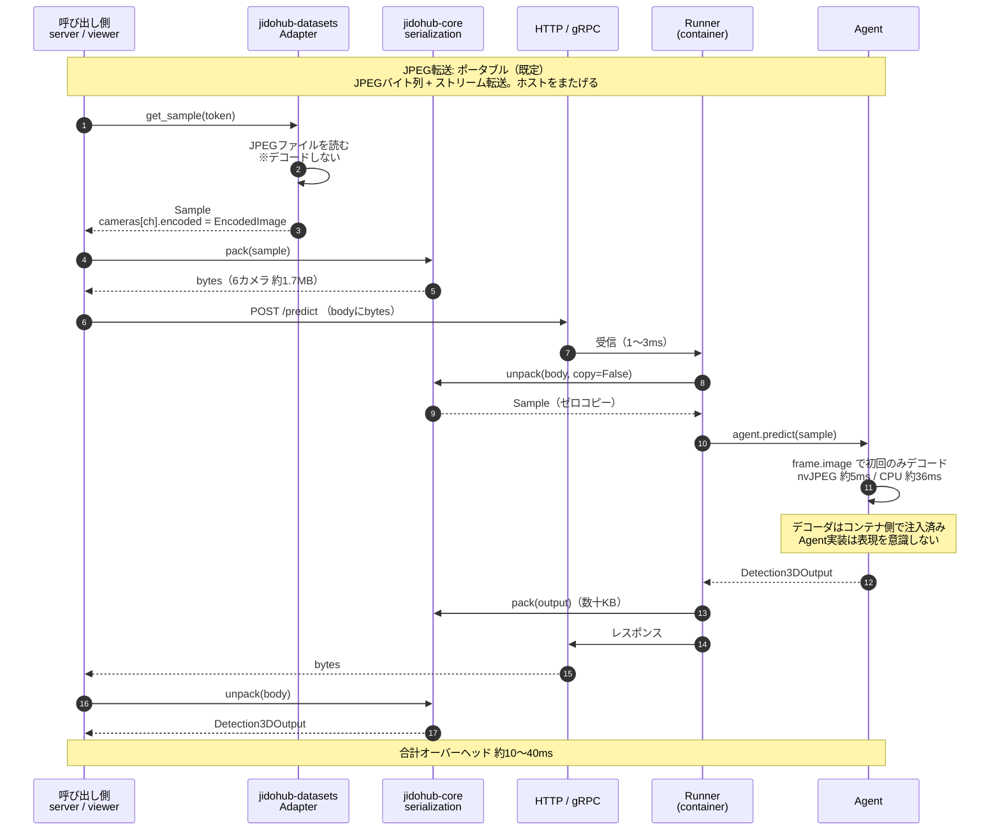
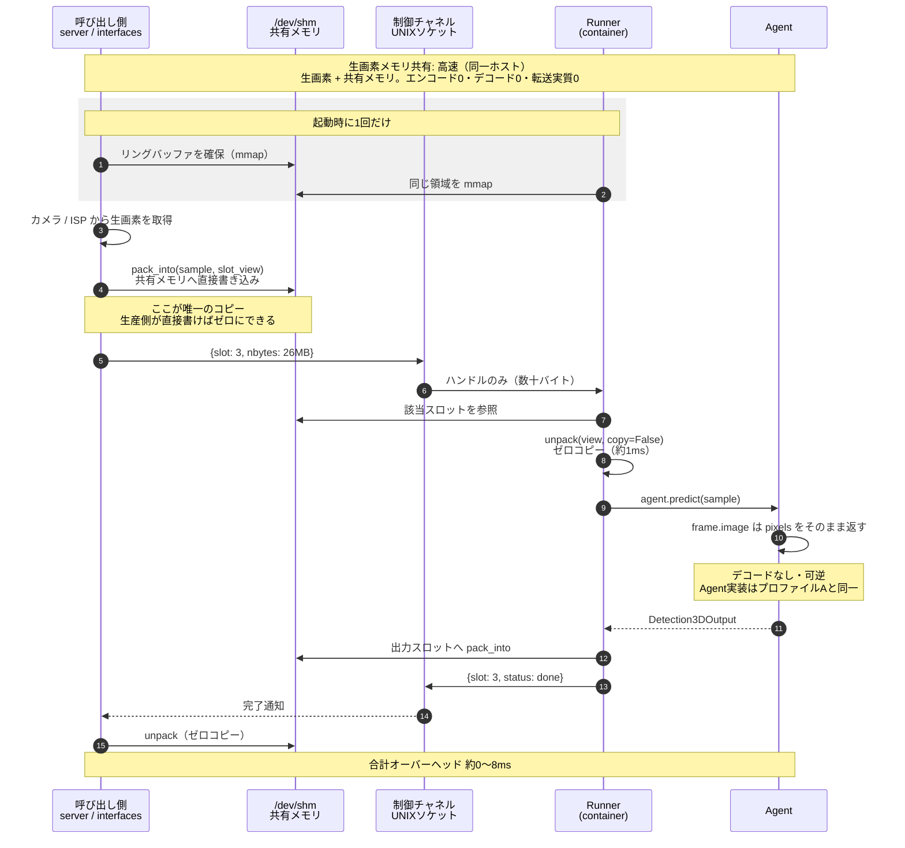

# jidohub-agent

### `runner="docker"`での画像転送

`runner="docker"`の場合、Python APIはホストPC上のプロセス（あるいは独自に立ち上げたDockerコンテナ）で、AgentはDockerコンテナ上で動作するため、両者間の画像転送が動作サイクルのボトルネックとなりえます。これに対処するためjidohubのPython APIでは、以下の2種類の転送方法を選択できます

||JPEG転送（使い勝手重視）|生画素メモリ共有（速度重視）|
|---|---|---|
|転送方法|HTTP / gRPC（バイトストリーム）|共有メモリ（/dev/shm）|
|転送時のデータ形式|JPEGバイト列（`EncodedImage`）|生画素（`pixels`）。将来的にはNV12も検討|
|メリット|Python API呼び出しとAgentが別マシンでも動く|高速|
|ユースケース|viewerでの可視化、評価ジョブ、自動アノテーション、クロスホスト構成|実車のdockerデプロイ、閉ループシミュレーション、同一ホストでの高頻度推論|

#### JPEG転送の動作フロー



#### 生画素メモリ共有の動作フロー



#### 処理の流れをPythonで表現

```python
"""転送プロファイル A / B の呼び出し側実装例。

- **プロファイルA（ポータブル）**: JPEG バイト列 + HTTP ストリーム転送。既定。
- **プロファイルB（高速）**: 生画素 + 共有メモリ転送。同一ホスト・実時間向け。

重要な性質
    **Agent 側の実装は両プロファイルで完全に同一**（末尾の ``ExampleAgent`` を参照）。
    転送方式を選ぶのは server / interfaces の責務であり、Agent には見せない。

Note:
    ``pack_into`` は **未実装の提案 API** です（プロファイルB で必要になる）。
    現行の core にあるのは ``pack`` / ``unpack`` のみ。
"""

from __future__ import annotations

from multiprocessing import shared_memory
from pathlib import Path
from typing import Any

import numpy as np

from jidohub.core.schemas import (
    CameraFrame,
    Detection3DOutput,
    EncodedImage,
    ImageFormat,
    LidarSweep,
    Sample,
)
from jidohub.core.serialization import pack, unpack

# =====================================================================
# プロファイルA: ポータブル（JPEG + ストリーム転送）
# =====================================================================


def build_sample_encoded(record: Any) -> Sample:
    """データセットの JPEG を**デコードせずに**載せる。

    nuScenes の画像はディスク上で既に JPEG なので、読んだバイト列を
    そのまま渡すだけでよい。呼び出し側でのデコードは一切発生しない。
    """
    cameras = {}
    for channel, meta in record.cameras.items():
        raw = Path(meta.path).read_bytes()
        cameras[channel] = CameraFrame(
            intrinsic=meta.intrinsic,
            sensor_to_ego=meta.sensor_to_ego,
            channel=channel,
            encoded=EncodedImage.from_bytes(
                raw,
                ImageFormat.JPEG,
                height=meta.height,
                width=meta.width,
            ),
        )

    return Sample(
        timestamp=record.timestamp,
        ego_to_global=record.ego_to_global,
        cameras=cameras,
        lidar=LidarSweep(
            points=record.points,
            sensor_to_ego=record.lidar_sensor_to_ego,
        ),
        sample_id=record.token,
    )


class HttpTransport:
    """プロファイルA の転送。ホストをまたげる。"""

    CONTENT_TYPE = "application/x-jidohub"

    def __init__(self, endpoint: str, client: Any) -> None:
        self.endpoint = endpoint
        self.client = client  # httpx.Client 等

    def predict(self, sample: Sample) -> Detection3DOutput:
        payload = pack(sample)  # 6カメラで約1.7MB
        response = self.client.post(
            f"{self.endpoint}/predict",
            content=payload,
            headers={"Content-Type": self.CONTENT_TYPE},
        )
        response.raise_for_status()
        return unpack(response.content)


def profile_a_example(record: Any, client: Any) -> Detection3DOutput:
    transport = HttpTransport("http://runner:8000", client)
    return transport.predict(build_sample_encoded(record))


# =====================================================================
# プロファイルB: 高速（生画素 + 共有メモリ）
# =====================================================================


def build_sample_raw(frame_buffers: dict[str, np.ndarray], record: Any) -> Sample:
    """カメラ / ISP から得た生画素をそのまま載せる。

    ``frame_buffers`` の配列が共有メモリ上のビューであれば、
    このあとの ``pack_into`` でのコピーも実質的に不要になる。
    """
    cameras = {
        channel: CameraFrame(
            intrinsic=record.intrinsics[channel],
            sensor_to_ego=record.extrinsics[channel],
            channel=channel,
            pixels=pixels,  # (H, W, 3) uint8 RGB
        )
        for channel, pixels in frame_buffers.items()
    }
    return Sample(
        timestamp=record.timestamp,
        ego_to_global=record.ego_to_global,
        cameras=cameras,
    )


class SharedMemoryTransport:
    """プロファイルB の転送。同一ホスト限定。

    リングバッファを共有メモリ上に確保し、スロット番号だけを
    制御チャネル（UNIX ソケット等）で受け渡す。
    26MB の転送が数十バイトの通知に置き換わる。
    """

    def __init__(
        self,
        name: str,
        control: Any,
        slot_bytes: int = 64 << 20,
        slots: int = 3,
    ) -> None:
        self.slot_bytes = slot_bytes
        self.slots = slots
        self.control = control
        # 起動時に1回だけ確保する。コンテナ側は同名で attach する
        self.shm = shared_memory.SharedMemory(
            name=name, create=True, size=slot_bytes * slots
        )
        self._cursor = 0

    def _slot_view(self, index: int) -> memoryview:
        start = index * self.slot_bytes
        return memoryview(self.shm.buf)[start : start + self.slot_bytes]

    def predict(self, sample: Sample) -> Detection3DOutput:
        slot = self._cursor
        self._cursor = (self._cursor + 1) % self.slots

        # 共有メモリへ直接書き込む（bytes を経由しない）
        # NOTE: pack_into は未実装の提案 API
        nbytes = pack_into(sample, self._slot_view(slot))  # noqa: F821

        # 制御チャネルにはハンドルだけを送る
        self.control.send_json({"slot": slot, "nbytes": nbytes})
        result = self.control.recv_json()

        # 出力もゼロコピーで読む
        output_view = self._slot_view(result["slot"])[: result["nbytes"]]
        return unpack(output_view, copy=False)

    def close(self) -> None:
        self.shm.close()
        self.shm.unlink()


def profile_b_example(
    frame_buffers: dict[str, np.ndarray], record: Any, control: Any
) -> Detection3DOutput:
    transport = SharedMemoryTransport("jidohub-frames", control)
    try:
        return transport.predict(build_sample_raw(frame_buffers, record))
    finally:
        transport.close()


# =====================================================================
# Agent 側（両プロファイルで完全に同一）
# =====================================================================


class ExampleAgent:
    """Agent は転送プロファイルを一切意識しない。

    ``frame.image`` は、プロファイルA なら初回アクセス時にデコードした結果を、
    プロファイルB なら共有メモリ上の生画素をそのまま返す。
    ``if frame.is_encoded:`` のような分岐を書く必要はない。
    """

    def predict(self, sample: Sample) -> Detection3DOutput:
        front = sample.cameras["CAM_FRONT"]

        image = front.image  # (H, W, 3) uint8 RGB。表現によらず同じ
        height, width = front.height, front.width  # デコード不要で取得できる

        points = sample.lidar.points if sample.lidar else None
        return self._infer(image, points, front.intrinsic, front.sensor_to_ego)

    def _infer(self, image, points, intrinsic, sensor_to_ego) -> Detection3DOutput:
        raise NotImplementedError
```

#### Python API呼び出し側もDockerコンテナの場合の注意

**必要な設定は2つ**です。IPC 名前空間の共有と、`/dev/shm` のサイズ拡張です。

```yaml
# docker compose
services:
  producer:
    ipc: shareable
    shm_size: 512mb
  agent-runner:
    ipc: "service:producer"    # producer の IPC 名前空間に参加
    shm_size: 512mb
```

`docker run` なら `--ipc=shareable` と `--ipc=container:<name>` の組み合わせです。Kubernetes の場合は**同一 Pod 内**である必要があり、`emptyDir` に `medium: Memory` を指定して両コンテナにマウントします（Pod をまたぐ共有メモリは不可）。

**`shm_size` の既定は 64MB** で、6カメラ分の 26MB × スロット数には足りません。ここを忘れると実行時に容量不足で失敗するので、上の例でも明示しています。

##### 重要なトレードオフ

IPC 名前空間を共有すると、**両コンテナは互いの共有メモリセグメントに読み書きできます**。これは jidohub のセキュリティ設計と正面から衝突します。未審査コード（`remote_code`）を隔離するために docker runner を使っているのに、IPC 名前空間を共有すれば、Agent 側から呼び出し側のバッファが見える状態になるためです。

したがって**運用ルールとして、`transport="shm"` は native または Verified な Agent に限定すべき**です。これは実装で強制できます。

```python
if transport == "shm" and config.implementation.type == "remote_code":
    raise ValueError(
        'transport="shm" requires a shared IPC namespace, which weakens the '
        "isolation boundary. Use it only with native or verified agents."
    )
```

`remote_code` と `isolation: required` を紐付けたのと同じ発想で、スキーマではなく Runner の引数検証として実装する箇所です。実車デプロイでは自社の Agent を使うのが通常なので、実用上の制約にはならないはずです。

なお `--ipc=host` は名前空間をホスト全体と共有するのでさらに広く、避けるべきです。`shareable` + `container:` で必要な2者に限定するのが正しい形です。

**もう1点、Python 固有の注意**があります。`multiprocessing.shared_memory` は `resource_tracker` にセグメントを登録するため、複数プロセスから同名のセグメントに attach すると警告やリークが起きやすいです。実装時は `resource_tracker` の登録を回避するか、`/dev/shm` 上のファイルを直接 `mmap` する低レベル実装にするほうが安定します。これは `pack_into()` を実装する段階で詰める話です。

## Native Agentの実装方針

### mmdet3d等の外部プラットフォームの活用

結論から言うと、**推論コードはスクラッチ実装（正確には最小依存での再実装）、学習・重み生成にはmmdetection3dを使う、という分離**を推奨します。どちらか一方ではなく役割で分けるのが最適です。

#### 推論をmmdet3dに依存させるべきでない理由

ネイティブクラスの存在意義から逆算すると答えが出ます。前回整理した通り、ネイティブクラスの目的は (a) スキーマ設計の妥当性検証、(b) 登録者が真似るお手本、(c) デモがゼロ依存で動くこと、そして**inprocess実行を許可できる信頼済み実装**であることです。ここにmmdet3dを持ち込むと：

- mmcv / mmengine / mmdet の3層依存が付いてきて、PyTorch・CUDAバージョンが強く固定されます。これは「依存衝突があるモデルはdocker runnerに隔離する」対象の性質そのもので、**ネイティブクラス＝クリーンなinprocess実行という設計思想と正面から矛盾**します
- adhub-modelsを `pip install` した全ユーザーにmmcv（ビルドが不安定なことで有名）を強制することになります
- mmdet3dのconfigシステム（Registry、config継承）とadhubの `agent_config.json` という2つの設定体系が混在し、「お手本」としての可読性が失われます
- mm系はメンテナンスの活発さに波があり、新PyTorchへの追従遅れが自プラットフォームの足枷になります

#### スクラッチ実装が現実的である理由と、1つの重要な技術的選択

CenterPointのスクラッチ実装で唯一重いのは、voxelベースのバックボーンが必要とする**sparse convolution（spconv）**です。ここで実装バリアントの選択が効いてきます。

**CenterPoint-Pillar（PointPillarsエンコーダ版）を最初のネイティブ実装にする**ことを勧めます。pillar版はsparse convが不要で、エンコーダはscatter操作＋通常のConv2Dだけ、つまり**純PyTorchのみで完結**します。実装量はモデル本体（pillar encoder + SECOND FPN + CenterHead）で2,000行前後、加えてNuScenes向けの前処理・後処理（voxel化、NMS、デコード）が1,000行程度の規模感で、CenterPointはアーキテクチャがシンプルなので十分手が届きます。voxel版（spconv依存）は精度は上がりますが、`spconv-cu1xx` というCUDA固定の依存が増えるので、後から追加バリアントとして検討すれば十分です。デモ・お手本・スキーマ検証という目的にはpillar版の精度（NDS ~60前後）で全く問題ありません。

#### mmdet3dの正しい使い所

一方で、学習パイプライン（データ拡張、CBGS、学習スケジュール）をスクラッチで再現するのは推論の数倍の労力で、かつ再現に失敗すると精度が出ず「実装が悪いのかスキーマが悪いのか」の切り分けに苦しみます。計算資源があるとのことなので：

1. mmdet3dでCenterPoint-Pillarを学習（または公式チェックポイントを流用）
2. **重み変換スクリプト**（mmdet3dのstate_dict → adhubネイティブ実装のstate_dict、キー名マッピングのみ）を書く
3. 変換後、同一入力での出力一致テスト（許容誤差内）をCIに入れる

という流れにすれば、mmdet3dは「重み工場」としてリポジトリ外（開発環境）に留まり、adhub-models本体の依存には一切入りません。この重み変換＋出力一致検証は、将来ユーザーがmm系で学習したモデルを持ち込む際のお手本にもそのままなります。

なお、これとは別にmmdet3dベースのモデルを丸ごと動かす道は、trust_remote_code + docker runnerの側で担保されます。つまり「mm系エコシステムはコンテナ隔離側の第一級市民、ネイティブクラスは純PyTorchの最小依存」という住み分けが、これまで設計してきた二層構造ときれいに対応します。

### Native Agentの性能一致検証

良い着眼です。この「性能一致検証」は一度きりの作業に見えて、実はプラットフォームの恒久的な資産（回帰テスト、将来の持ち込みモデル検証のお手本）になるので、置き場所を丁寧に決める価値があります。結論としては**単一の「評価基盤リポジトリ」を作るのではなく、検証を3段階に分解し、それぞれ性質に合った場所に置く**ことを推奨します。

#### 検証の3段階と置き場所

**段階1: テンソルレベルの一致テスト → adhub-modelsの通常のテスト（`tests/`）**

モジュール単位（pillar encoder、FPN、CenterHead、デコード）で、mmdet3dと同一の入力テンソルを与えて出力が許容誤差（1e-4〜1e-5程度）で一致するかを見るテストです。実装ミスの箇所を特定できるのはこの段階だけなので、最も重要です。やり方としては、開発環境でmmdet3d側の各モジュールの入出力を小さな固定データ（数サンプル分の `.npz` / `.safetensors`）として一度だけ吐き出し、**fixtureとしてadhub-modelsリポジトリにコミット**します。以後のCIではmmdet3dを一切必要とせず、fixtureとの比較だけが走ります。mmdet3dを「重み工場」としてリポジトリ外に留めるという前回の方針が、テストでもそのまま通用する形です。

**段階2: 単一サンプルのend-to-end一致テスト → 同じくadhub-modelsの`tests/`**

生のnuScenesサンプル1〜2個を入力に、前処理→推論→後処理まで通した最終的なBox出力の一致を見ます。経験上、不一致の原因はモデル本体より**前処理・後処理（voxel化の丸め、NMSの実装差、座標系変換）に潜むことが圧倒的に多い**ので、段階1が通っても段階2は別途必要です。ここも入力サンプルと期待出力をfixture化すればCIで回せます（許容誤差は段階1より緩め、NMS前後で件数一致＋IoUベースのマッチングなど）。

**段階3: データセット全体でのメトリクス一致 → adhub-models内のevaluateモジュール + ベンチマークハーネス**

nuScenes val全体でNDS/mAPを算出し、mmdet3dの報告値と比較する段階です。ここで重要な実務的アドバイスがあります。**検出メトリクスの計算自体はスクラッチ実装せず、公式のnuscenes-devkitの評価コードを使ってください。** mmdet3d自身も内部でnuscenes-devkitの評価を呼んでいるので、同じ評価コードを使えば「メトリクス実装の差」という変数が消え、純粋にモデル出力の差だけを比較できます。したがってevaluateモジュールの初期実装は、`Detection3DOutput`（adhubスキーマ）→ devkitの提出フォーマットへの変換 + devkit評価のラッパー、という薄いもので十分です。これは「evaluateは一旦adhub-modelsに内包」という先の決定ともサイズ感が合います。

#### ベンチマークハーネスの依存関係の扱い

段階3のハーネス（データセットを回して `predict()` を呼び、結果を集計するランナー）は、adhub-datasets（nuScenes Adapter）とadhub-modelsの両方に依存します。星形依存の原則からするとやや例外的な存在ですが、独立リポジトリを立てるほどの規模ではないので、**adhub-modelsのoptional extraとして持つ**のが現実的です。

```
adhub-models/
├── src/adhub_models/
│   ├── evaluate/          # メトリクスラッパー（devkit変換等）
│   └── ...
├── benchmarks/            # ハーネス（CLIスクリプト）
│   └── run_detection_benchmark.py
└── pyproject.toml         # [project.optional-dependencies] benchmark = ["adhub-datasets", "nuscenes-devkit"]
```

通常の `pip install adhub-models` にはadhub-datasetsは入らず、`pip install adhub-models[benchmark]` のときだけ入る形にすれば、コア依存の純粋性は保てます。将来evaluateを独立リポジトリに切り出す際は、この `evaluate/` + `benchmarks/` がそのまま移動する単位になります。

#### CIの回し方と結果の置き場所

段階1・2はfixtureベースでCPUでも回るので、**通常のCI（PRごと）に含めて恒久的な回帰テスト**にします。スキーマ変更や前処理修正でうっかり数値が変わる事故をここで検知できます。段階3はGPU + フルデータセットが必要なので、PRごとには回さず、リリース前または重み更新時の手動/nightlyジョブとします。

そして段階3の結果は、**モデルリポジトリフォーマットで定義済みの `benchmark.json` にそのまま書き込む**ことを勧めます。「CenterPoint-Pillarネイティブ実装のNDS/mAP、評価条件、mmdet3d報告値との差分」をここに記録すれば、検証の成果物がそのままプラットフォーム上のモデルカードの実績値になり、将来ユーザーがモデルを持ち込む際に「benchmark.jsonはこのハーネスで生成する」というワークフローのリファレンスにもなります。検証基盤を作ること自体が、プラットフォームの「ベンチマーク結果」機能（スライド4のAgentsリポジトリの項目）のドッグフーディングになる、という構図です。

最後に許容基準の目安ですが、段階3でmmdet3dの報告値と**NDSで±0.3ポイント程度**の差に収まれば実装として成功と見なしてよいです。評価時のNMSパラメータやテスト時拡張の有無で0.1〜0.2は普通に動くので、完全一致を追うより、段階1・2の厳密な一致で実装の正しさを担保し、段階3は「大きな取りこぼしがないことの確認」と位置づけるのが健全です。

### 学習

実データでの再学習は自動運転開発の本丸なので（センサ構成が変わるだけで再学習が必要になる領域です）、プラットフォームとして学習への道筋は必ず用意すべきです。ポイントは、**adhubが学習のどこで固有の価値を出せるかを見極めて、段階的に踏み込む**ことです。整理します。

#### 短期: ご認識の通り「ドキュメント化された持ち込みパス」

CenterPointの例で言えば、まさにお書きになった形が正解です。ただし前回までに作った資産のおかげで、これは「ただのドキュメント」ではなく**検証付きのワークフロー**として提供できます。

1. オリジナルデータをmmdet3dの学習フォーマット（info file等）に変換して学習する手順
2. 重み変換スクリプト（mmdet3d state_dict → adhubネイティブ実装）— CenterPoint検証で作成済みのものを公開ツール化
3. 変換後の出力一致テスト（fixture比較）を手元で実行する方法
4. ベンチマークハーネスで自データのvalを評価し `benchmark.json` を生成
5. adhub-webへアップロード

つまり「学習はmm系で、検証と配布と評価はadhubで」という分業です。3と4があることで、ユーザーは変換ミスを自分で検出でき、アップロードされるモデルの品質も担保されます。これはHuggingFaceに例えると「Megatronで学習してtransformers形式に変換してアップロードする」パスに相当し、実際大規模モデルの多くはそうやってHubに載っています。

#### 中期: adhubの本当のレバレッジは「学習ループ」ではなく「データパス」

ここが今回の質問の核心だと思います。「自分のデータで学習したい」の実務上のボトルネックは、学習ループの実装ではなく、**自前データを学習フレームワークが食える形に整えるまでの前段**です。センサ配置の記述、キャリブレーション、座標系、アノテーション形式の変換 — ここで皆消耗します。そしてこの領域は、adhubが既に持っている資産（標準 `Sample` スキーマ、adhub-datasetsのAdapter機構）の真正面です。

具体的には、adhub-datasetsに次の2方向の機能を持たせます。

- **取り込み方向**: 「自前データ → 標準スキーマ」のAdapter作成ガイドとテンプレート。ユーザーは自分のデータセットを一度adhubスキーマに載せれば、可視化（nuscenes-viewer）・評価・配布がすべて使えるようになる
- **書き出し方向**: 「標準スキーマ → 学習フレームワーク形式」のExporter。mmdet3dのinfo file形式への変換を最初に提供すれば、「adhubに載せたデータはワンコマンドでmm系の学習に流せる」状態になる

こうすると学習フレームワーク自体は外部のままでも、**「データをadhubスキーマに載せることが学習への最短路」という構図**が生まれ、プラットフォームの引力になります。さらに言えば、nuscenes-viewerのアノテーション機能（既に実装済み）とAIアシストアノテーションがこの上流に接続するので、「実車データ取得 → viewerでアノテーション → adhub-datasets化 → 学習 → 変換・検証 → アップロード → 評価ラン」という**開発ループ全体がプラットフォーム内で閉じます**。これはスライド3の「登録したデータセットを連携しアノテーション・詳細管理を可能にする」という構想の具体化そのものです。

#### 長期: 汎用Trainerではなく「モデル別学習レシピ」から入る

将来学習機能を内製化する場合も、HuggingFace Trainerのような汎用抽象から入るのではなく、**ネイティブクラスに限定した「学習レシピ」**から始めることを勧めます。CenterPoint-Pillarのネイティブ実装は純PyTorchなので、その学習スクリプト（データローダー、損失、拡張、スケジュール一式）を `examples/train_centerpoint_pillar.py` のような形で同梱することは、汎用Trainerの設計問題を回避しつつ「adhubだけで学習が完結する」パスを提供できます。mm系依存も消えるので、「学習もクリーンな環境でやりたい」層への答えになります。レシピが2〜3モデル分溜まった時点で共通部分をTrainerとして抽出する、という帰納的な進め方が、演繹的に抽象を設計するより失敗しにくいです。

#### まとめ

- 短期はご認識の通り「mm系で学習 → 変換 → 検証 → アップロード」のドキュメント化。ただし変換スクリプトと一致テストという検証装置付きで提供する
- 中期の主戦場は学習ループではなくデータパス。adhub-datasetsの取り込みAdapterと学習形式Exporterで「自前データの学習準備」を握るのがプラットフォームとして最も価値が高い
- 長期はネイティブモデル別の学習レシピ → 帰納的にTrainer化。汎用Trainer先行は避ける

「学習を他所に任せる」のではなく、「学習ループは当面外部に任せ、その前後（データ準備・検証・配布・評価）を全部押さえる」戦略、と捉えていただくのが正確です。前後を押さえていれば、学習ループの内製はいつでも後から足せます。

## Agent作成方法

### Dockerfile

- ビルドに`TORCH_CUDA_ARCH_LIST`が必要なことが多い（ユーザーにより環境が異なるため、動的に指定できる仕組みが必要）
- 重みダウンロードはなるべくHuggingFace等を活用したい
- 外部の重みを使用する場合はライセンスに注意
