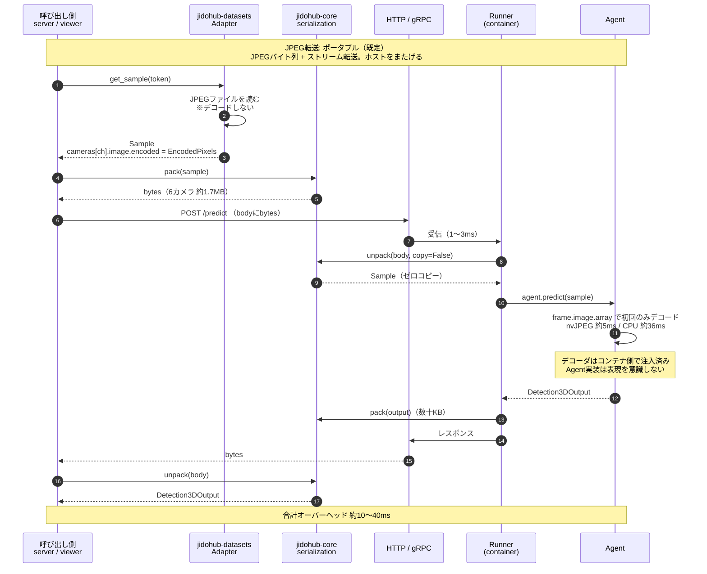
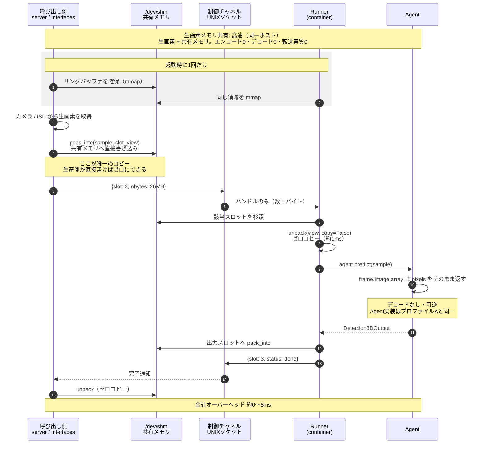

### `runner="docker"`での画像転送

`runner="docker"`の場合、Python APIはホストPC上のプロセス（あるいは独自に立ち上げたDockerコンテナ）で、AgentはDockerコンテナ上で動作するため、両者間の画像転送が動作サイクルのボトルネックとなりえます。これに対処するためjidohubのPython APIでは、以下の2種類の転送方法を選択できます

||JPEG転送（使い勝手重視）|生画素メモリ共有（速度重視）|
|---|---|---|
|転送方法|HTTP / gRPC（バイトストリーム）|共有メモリ（/dev/shm）|
|転送時のデータ形式|JPEGバイト列（`EncodedPixels`）|生画素（`pixels`）。将来的にはNV12も検討|
|メリット|Python API呼び出しとAgentが別マシンでも動く|高速|
|ユースケース|viewerでの可視化、評価ジョブ、自動アノテーション、クロスホスト構成|実車のdockerデプロイ、閉ループシミュレーション、同一ホストでの高頻度推論|

#### JPEG転送の動作フロー



#### 生画素メモリ共有の動作フロー



#### 処理の流れをPythonで表現

```python
"""転送プロファイル A / B の呼び出し側実装例。

- **プロファイルA（ポータブル）**: JPEG バイト列 + HTTP ストリーム転送。既定。
- **プロファイルB（高速）**: 生画素 + 共有メモリ転送。同一ホスト・実時間向け。

重要な性質
    **Agent 側の実装は両プロファイルで完全に同一**（末尾の ``ExampleAgent`` を参照）。
    転送方式を選ぶのは server / interfaces の責務であり、Agent には見せない。

Note:
    ``pack_into`` は **未実装の提案 API** です（プロファイルB で必要になる）。
    現行の core にあるのは ``pack`` / ``unpack`` のみ。
"""

from __future__ import annotations

from multiprocessing import shared_memory
from pathlib import Path
from typing import Any

import numpy as np

from jidohub.core.schemas import (
    CameraFrame,
    Detection3DOutput,
    EncodedPixels,
    Image,
    ImageFormat,
    LidarSweep,
    Sample,
)
from jidohub.core.serialization import pack, unpack

# =====================================================================
# プロファイルA: ポータブル（JPEG + ストリーム転送）
# =====================================================================


def build_sample_encoded(record: Any) -> Sample:
    """データセットの JPEG を**デコードせずに**載せる。

    nuScenes の画像はディスク上で既に JPEG なので、読んだバイト列を
    そのまま渡すだけでよい。呼び出し側でのデコードは一切発生しない。
    """
    cameras = {}
    for channel, meta in record.cameras.items():
        raw = Path(meta.path).read_bytes()
        cameras[channel] = CameraFrame(
            image=Image(
                encoded=EncodedPixels.from_bytes(
                    raw,
                    ImageFormat.JPEG,
                    height=meta.height,
                    width=meta.width,
                ),
                intrinsic=meta.intrinsic,
            ),
            sensor_to_ego=meta.sensor_to_ego,
            channel=channel,
        )

    return Sample(
        timestamp=record.timestamp,
        ego_to_global=record.ego_to_global,
        cameras=cameras,
        lidar=LidarSweep(
            points=record.points,
            sensor_to_ego=record.lidar_sensor_to_ego,
        ),
        sample_id=record.token,
    )


class HttpTransport:
    """プロファイルA の転送。ホストをまたげる。"""

    CONTENT_TYPE = "application/x-jidohub"

    def __init__(self, endpoint: str, client: Any) -> None:
        self.endpoint = endpoint
        self.client = client  # httpx.Client 等

    def predict(self, sample: Sample) -> Detection3DOutput:
        payload = pack(sample)  # 6カメラで約1.7MB
        response = self.client.post(
            f"{self.endpoint}/predict",
            content=payload,
            headers={"Content-Type": self.CONTENT_TYPE},
        )
        response.raise_for_status()
        return unpack(response.content)


def profile_a_example(record: Any, client: Any) -> Detection3DOutput:
    transport = HttpTransport("http://runner:8000", client)
    return transport.predict(build_sample_encoded(record))


# =====================================================================
# プロファイルB: 高速（生画素 + 共有メモリ）
# =====================================================================


def build_sample_raw(frame_buffers: dict[str, np.ndarray], record: Any) -> Sample:
    """カメラ / ISP から得た生画素をそのまま載せる。

    ``frame_buffers`` の配列が共有メモリ上のビューであれば、
    このあとの ``pack_into`` でのコピーも実質的に不要になる。
    """
    cameras = {
        channel: CameraFrame(
            image=Image(
                pixels=pixels,  # (H, W, 3) uint8 RGB
                intrinsic=record.intrinsics[channel],
            ),
            sensor_to_ego=record.extrinsics[channel],
            channel=channel,
        )
        for channel, pixels in frame_buffers.items()
    }
    return Sample(
        timestamp=record.timestamp,
        ego_to_global=record.ego_to_global,
        cameras=cameras,
    )


class SharedMemoryTransport:
    """プロファイルB の転送。同一ホスト限定。

    リングバッファを共有メモリ上に確保し、スロット番号だけを
    制御チャネル（UNIX ソケット等）で受け渡す。
    26MB の転送が数十バイトの通知に置き換わる。
    """

    def __init__(
        self,
        name: str,
        control: Any,
        slot_bytes: int = 64 << 20,
        slots: int = 3,
    ) -> None:
        self.slot_bytes = slot_bytes
        self.slots = slots
        self.control = control
        # 起動時に1回だけ確保する。コンテナ側は同名で attach する
        self.shm = shared_memory.SharedMemory(
            name=name, create=True, size=slot_bytes * slots
        )
        self._cursor = 0

    def _slot_view(self, index: int) -> memoryview:
        start = index * self.slot_bytes
        return memoryview(self.shm.buf)[start : start + self.slot_bytes]

    def predict(self, sample: Sample) -> Detection3DOutput:
        slot = self._cursor
        self._cursor = (self._cursor + 1) % self.slots

        # 共有メモリへ直接書き込む（bytes を経由しない）
        # NOTE: pack_into は未実装の提案 API
        nbytes = pack_into(sample, self._slot_view(slot))  # noqa: F821

        # 制御チャネルにはハンドルだけを送る
        self.control.send_json({"slot": slot, "nbytes": nbytes})
        result = self.control.recv_json()

        # 出力もゼロコピーで読む
        output_view = self._slot_view(result["slot"])[: result["nbytes"]]
        return unpack(output_view, copy=False)

    def close(self) -> None:
        self.shm.close()
        self.shm.unlink()


def profile_b_example(
    frame_buffers: dict[str, np.ndarray], record: Any, control: Any
) -> Detection3DOutput:
    transport = SharedMemoryTransport("jidohub-frames", control)
    try:
        return transport.predict(build_sample_raw(frame_buffers, record))
    finally:
        transport.close()


# =====================================================================
# Agent 側（両プロファイルで完全に同一）
# =====================================================================


class ExampleAgent:
    """Agent は転送プロファイルを一切意識しない。

    ``frame.image.array`` は、プロファイルA なら初回アクセス時にデコードした結果を、
    プロファイルB なら共有メモリ上の生画素をそのまま返す。
    ``if frame.image.is_encoded:`` のような分岐を書く必要はない。
    """

    def predict(self, sample: Sample) -> Detection3DOutput:
        front = sample.cameras["CAM_FRONT"]

        image = front.image.array  # (H, W, 3) uint8 RGB。表現によらず同じ
        height, width = front.image.height, front.image.width  # デコード不要で取得できる

        points = sample.lidar.points if sample.lidar else None
        return self._infer(image, points, front.image.intrinsic, front.sensor_to_ego)

    def _infer(self, image, points, intrinsic, sensor_to_ego) -> Detection3DOutput:
        raise NotImplementedError
```

#### Python API呼び出し側もDockerコンテナの場合の注意

**必要な設定は2つ**です。IPC 名前空間の共有と、`/dev/shm` のサイズ拡張です。

```yaml
# docker compose
services:
  producer:
    ipc: shareable
    shm_size: 512mb
  agent-runner:
    ipc: "service:producer"    # producer の IPC 名前空間に参加
    shm_size: 512mb
```

`docker run` なら `--ipc=shareable` と `--ipc=container:<name>` の組み合わせです。Kubernetes の場合は**同一 Pod 内**である必要があり、`emptyDir` に `medium: Memory` を指定して両コンテナにマウントします（Pod をまたぐ共有メモリは不可）。

**`shm_size` の既定は 64MB** で、6カメラ分の 26MB × スロット数には足りません。ここを忘れると実行時に容量不足で失敗するので、上の例でも明示しています。

##### 重要なトレードオフ

IPC 名前空間を共有すると、**両コンテナは互いの共有メモリセグメントに読み書きできます**。これは jidohub のセキュリティ設計と正面から衝突します。未審査コード（`remote_code`）を隔離するために docker runner を使っているのに、IPC 名前空間を共有すれば、Agent 側から呼び出し側のバッファが見える状態になるためです。

したがって**運用ルールとして、`transport="shm"` は native または Verified な Agent に限定すべき**です。これは実装で強制できます。

```python
if transport == "shm" and config.implementation.type == "remote_code":
    raise ValueError(
        'transport="shm" requires a shared IPC namespace, which weakens the '
        "isolation boundary. Use it only with native or verified agents."
    )
```

`remote_code` と `isolation: required` を紐付けたのと同じ発想で、スキーマではなく Runner の引数検証として実装する箇所です。実車デプロイでは自社の Agent を使うのが通常なので、実用上の制約にはならないはずです。

なお `--ipc=host` は名前空間をホスト全体と共有するのでさらに広く、避けるべきです。`shareable` + `container:` で必要な2者に限定するのが正しい形です。

**もう1点、Python 固有の注意**があります。`multiprocessing.shared_memory` は `resource_tracker` にセグメントを登録するため、複数プロセスから同名のセグメントに attach すると警告やリークが起きやすいです。実装時は `resource_tracker` の登録を回避するか、`/dev/shm` 上のファイルを直接 `mmap` する低レベル実装にするほうが安定します。これは `pack_into()` を実装する段階で詰める話です。


